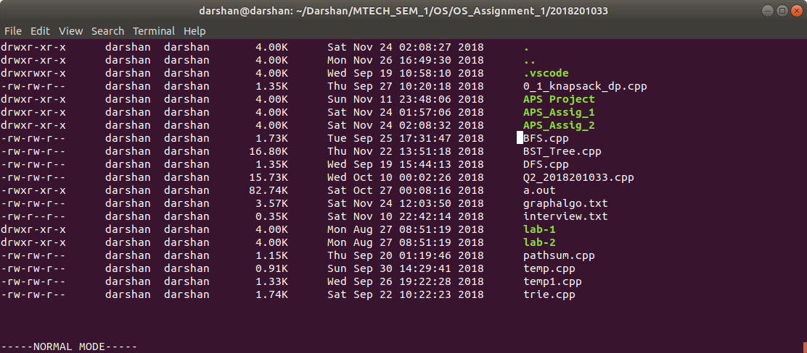

# Linux Terminal Based File Explorer

### Prerequisites
1. G++ compiler
   * ```sudo apt-get install g++```

### How to compile project
1. go to project directory and run following command
   * ```make```
3. To clean solution 
   * ```make clean```
   
### How to Run project
```
./main
```
### Functionality Terminal File Explorer 
File explorer is work in two modes. 
The application is start in normal mode, which is the default mode and used to explore the current directory and navigate around in the filesystem.
<br/>
The root of the application is the directory where the application was started.
<br/>
The last line of the display screen is to be used as status bar - to be used in normal and command-line modes.

### 1. Normal Mode:
1.1 **Read and display list of files and directories in the current folder**
* File explorer show each file in the directory (one entry per line). The following attributes are visible for each file
    * File Name
    * File size (Human readable format similar to ls -lh)
    * Ownership (User & Group) & Permissions
    * Last modified

* The File explorer also handle scrolling (vertical overflow) in case the directory has a lot of files.
* The file explorer also show the entries “.” & “..” for current and parent directory respectively.
* User is able to navigate up & down the file list using corresponding arrow keys.



1.2 **Open files & directories**
* When enter is pressed
    * Directory​ - It will Clear the screen and Navigate into the directory and shows the files & directories inside it as specified in point 1
    * Files​ - It will open files using the corresponding default application.


### 2. Command Mode:
The application is enter the command mode whenever the ```:``` (colon) key
is pressed. 
<br/>
Upon entering the command mode the user should be able to enter
different commands. All commands should appear in a bottom status bar

**2.1 copy, move and rename** 
```
copy <source_file(s)> <destination_directory>
move <source_file(s)> <destination_directory>
```

```
Eg:
copy foo.txt bar.txt baz.mp4 ~/foobar
move foo.txt bar.txt baz.mp4 ~/foobar
rename foo.txt bar.txt
```
Copying / Moving of directories is also be implemented

**2.2 create files and directories** 
```
create_file <file_name> <destination_path>
create_dir <dir_name> <destination_path>
```

```
Eg:
create_file foo.txt ~/foobar
create_file foo.txt .
create_dir folder_name ~/foobar
```

**2.3 delete files and directories** 
```
delete_file <file_path>
delete_dir <directory_path>
```

```
Eg:
delete_file ~/foobar/foo.txt.
delete_dir ~/foobar/folder_name
```

**2.4 goto** 
```
goto <directory_path>
```

```
Eg:
goto /home/darshan/
goto ~
```

**2.5 Search a file or folder given fullname.** 
```
search <filename>
```

```
Eg:
search foo.txt
```
Search for the given filename under the current directory recursively


**2.6 Snapshotting the filesystem and dump into a file** 
```
snapshot <folder> <dumpfile>​
```

```
Eg:
snapshot ~/foobar/ dumpimg
```
Given a base directory this command recursively crawl the directory and store the output in dumpfile.

**2.7 On pressing ‘ESC’ key the application should go to Normal Mode**